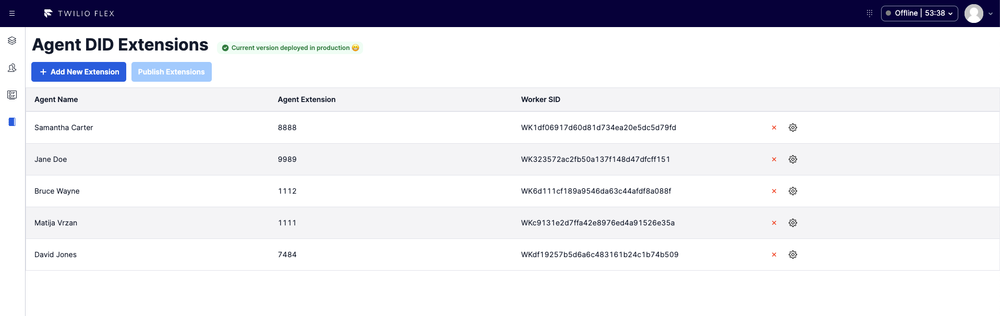
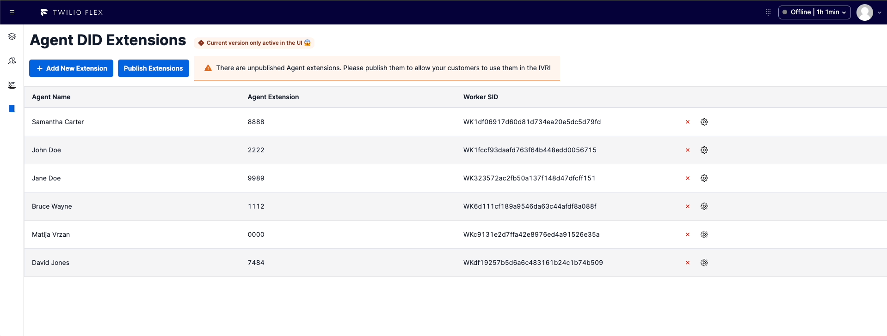

<a  href="https://www.twilio.com">

</a>

# Agent DID Extensions Plugin - Flex 2.X

Twilio Flex Plugins allow you to customize the appearance and behavior of [Twilio Flex](https://www.twilio.com/flex). If you want to learn more about the capabilities and how to use the API, check out our [Flex documentation](https://www.twilio.com/docs/flex).

## How it works

The _Agent DID Extensions Plugin_ allows customers to call a Flex agent directly with the help of an extension. It also enables supervisors to create, read, update, and delete agent extensions assigned to agents directly in the Flex UI.

From the Flex Supervisor view, agent extensions are loaded from a [Twilio Sync](https://www.twilio.com/sync/api) service. This enables a responsive user experience that provides immediate feedback.

Read agent extensions:



This view allows supervisors to create new agent extensions from the UI:


The plugin also enables supervisors to update an existing agent extension:


And last, but not least, supervisors can delete an existing agent extension:



## How are the agent extensions available to customers within the Studio Flow?

Once the supervisor has made all the desired changes in the UI, a Publish Extensions button will be enabled on the UI. This button is going to take the JSON file from the Sync Map and initiate a Twilio serverless build process where it will then be deployed as a [Twilio Asset](https://www.twilio.com/docs/serverless/functions-assets/assets).

This is what the publish process looks like:


Now that the agent extensions have been deployed to Twilio Assets, they are used in the Studio Flow by a Twilio serverless function that is going to search for the right agent within the JSON file and pass that information to the task router. This allows the plugin to scale and not to be limited by the Sync Map RPS limitations.

The Flex UI for this component is using Sync Map to enable a responsive use experience. Here is an example of the Sync Map JSON structure:

```
{
    "workerFullName":"John Doe",
    "extensionNumber":"7777",
    "workerSid":"WKxxxxxxxxxxxxxxxxxxxx"
}
```

## Architectural diagram

The below architectural diagram is a representation of involved Twilio services when a customer makes a call and enters agent's extension:


## TaskRouter Workflow setup

Before using this plugin you must first create a dedicated TaskRouter workflow or just add the following filter to your current workflow. Make sure it is part of your Flex Task Assignment workspace.

- set the "Known router" to Worker SID
- ensure the following matching worker expression: task.workerSID
- set up fallback options as you see fit


## StudioFlow setup

There's a lot of flexibility how the StudioFlow can be configured, but the following steps should be included:

- gather input digits entered by the caller
- pass the input digits to a serverless function
  
- pass the `workerSID` to Flex
  

## Things to think about

#### Default Sync service

This plugin is using the Sync [JavaScript SDK](https://media.twiliocdn.com/sdk/js/sync/releases/3.0.1/docs/index.html) which is using the default Sync service. In order to use a different Sync service, custom functions are recommended.

#### Supported Flex version

This plugin only supports Twilio Flex v2.x.

## ToDo List

#### Implement pagination

Right now, all of the Sync map items are listed on the single page which makes for a poor user experience.

#### Sorting

Implement sorting of the existing records in the UI.

### Agent and extension filtering

Allow users to search for specific agent and/or extension in the UI.

### Updated by and last updated

Insert two new columns that indicate when the filed was updated and by whom.

### ~~Convert to functional components~~

~~This version of the plugin is built using React class-based components. In order to follow more modern React development practices, this plugin should be converted to functional components.~~

### ~~Input field validation~~

~~Ensure users can only enter numbers into the agent extension input field.~~

## Development

Run `twilio flex:plugins --help` to see all the commands we currently support. For further details on Flex Plugins refer to our documentation on the [Twilio Docs](https://www.twilio.com/docs/flex/developer/plugins/cli) page.

# Configuration

## Requirements

To deploy this plugin, you will need:

- An active Twilio account with Flex provisioned. Refer to the [Flex Quickstart](https://www.twilio.com/docs/flex/quickstart/flex-basics#sign-up-for-or-sign-in-to-twilio-and-create-a-new-flex-project%22) to create one.
- npm version 5.0.0 or later installed (type `npm -v` in your terminal to check)
- Node.js version 12 or later installed (type `node -v` in your terminal to check). _Even_ versions of Node are. **Note:** In order to install Twilio Flex CLI plugin that is needed for locally running Flex, Node version 16 is the latest supported version (if you are using Node 18., please revert back or use Node Version Manager).
- [Twilio CLI](https://www.twilio.com/docs/twilio-cli/quickstart#install-twilio-cli) along with the [Flex CLI Plugin](https://www.twilio.com/docs/twilio-cli/plugins#available-plugins) and the [Serverless Plugin](https://www.twilio.com/docs/twilio-cli/plugins#available-plugins). Run the following commands to install them:

```
# Install the Twilio CLI
npm install twilio-cli -g
# Install the Serverless and Flex as Plugins
twilio plugins:install @twilio-labs/plugin-serverless
twilio plugins:install @twilio-labs/plugin-flex
```

- Once the Twilio CLI and Twilio Flex CLI plugins are successfully installed, configure your [Twilio CLI profile](https://www.twilio.com/docs/twilio-cli/general-usage). **Note:** This step is required if you are running Twilio CLI for the first time or if you have multiple Twilio CLI profiles configured.

## Setup

Install the dependencies by running `npm install`:

```bash
cd agent-did-extensions
npm install
cd ../agent-did-extensions
npm install
```

From the root directory, rename `public/appConfig.example.js` to `public/appConfig.js`.

```bash
mv public/appConfig.example.js public/appConfig.js
```

## Serverless Functions

### Deployment

Create the Serverless config file by copying `.env.example` to `.env`.

```bash
cd serverless
cp .env.example .env
```

Edit `.env` and set these variables with the Sids from your account.

```bash
# The following values are example references only
FLEX_APP_FUNCTIONS_BASE=
FLEX_SYNC_SERVICE_SID=ISxxxxxxxxxxxxxxxxxxxx
FLEX_SYNC_MAP_SID=MPxxxxxxxxxxxxxxxxxxxx
TWILIO_ACCOUNT_SID=ACxxxxxxxxxxxxxxxxxxxx
TWILIO_AUTH_TOKEN=
TWILIO_SERVICE_RETRY_LIMIT=5
TWILIO_SERVICE_MIN_BACKOFF=100
TWILIO_SERVICE_MAX_BACKOFF=300
TWILIO_ASSET_NAME=/extensions.json
```

Next, deploy the Serverless functions:

```bash
cd serverless
twilio serverless:deploy

```

**Note**: If you need to re-deploy the serverless functions, they will re-deploy whatever agent extensions JSON file lives in the source control. This means you will lose all of the changes from Sync Map. Once you've deployed the serverless functions, simply publish the changes from the UI.

Additional option is to create a script to fetch the lates JSON file directly from Sync Map and include that as your build artifact.

After successfully deploying your function, you should see at least the following:

```bash
✔ Serverless project successfully deployed


Deployment Details
Domain: xxx-xxx-xxxx-dev.twil.io

Functions:
   https://xxx-xxx-xxxx-dev.twil.io/agentExtensions
(more)
```

Your functions will now be present in the Twilio Functions Console and be part of the "serverless" service. Copy the base URL from the function.

## Flex Plugin

### Development

Create the plugin config file by copying `.env.example` to `.env`.

```bash
cd agent-DID-extensions/plugin-v2
cp .env.example .env
```

Edit `.env` and set the `FLEX_APP_FUNCTIONS_BASE` variable to your Twilio Functions base URL (like https://xxx-serverless-xxxx-dev.twil.io/).

Also make sure to set the `REACT_APP_SYNC_MAP_NAME` variable to the name of your Sync Map.

To run the plugin locally, you can use the Twilio Flex CLI plugin. Using your command line, run the following from the root directory of the plugin.

```bash
cd agent-DID-extensions/plugin-v2
twilio flex:plugins:start
```

This will automatically start up the webpack dev server and open the browser for you. Your app will run on `http://localhost:3000`.

When you make changes to your code, the browser window will be automatically refreshed.

### Deploy your Flex Plugin

Once you are happy with your Flex plugin, you have to deploy then release it on your Flex application.

Run the following command to start the deployment:

```bash
twilio flex:plugins:deploy --major --changelog "Releasing Agent DID Extensions plugin" --description "Agent DID Extensions"
```

After running the suggested next step, navigate to the [Plugins Dashboard](https://flex.twilio.com/admin/) to review your recently deployed plugin and confirm that it’s enabled for your contact center.

**Note:** Common packages like `React`, `ReactDOM`, `Redux` and `ReactRedux` are not bundled with the build because they are treated as external dependencies so the plugin will depend on Flex to provide them globally.

You are all set to test this plugin on your Flex application!

## Deployment to QA, Staging and Production environments

### CLI Profiles

Create Twilio CLI Profiles for each environment using

`twilio profiles:create`

This command will prompt your for the Account Sid, Auth Token and and a name/label for the profile. We recommend that the Profile Name matches the Twilio Account name to avoid confusion

To switch between profiles:

`twilio profiles:use "ProfileName"`

To check the configured profiles:

`twilio profiles:list`

### Serverless

Follow the steps in this [guide](https://www.twilio.com/docs/labs/serverless-toolkit/deploying) to deploy Serverless functions to multiple accounts/environment.

Using `.env.example` create `.env.stage` and `.env.prod` files and update each with the correct resource Sids from the respective account.
Note: Make sure your .gitignore contains the names of these files so they will be excluded from any commit to your repo.

After switching the CLI to use a different profile (i.e. Account Sid), you can use these commands to deploy the serverless functions with the correct set of environment variables.

`twilio serverless:deploy --env .env.stage --environment=staging`

`twilio serverless:deploy --env .env.prod --environment=production`

### Plugin

Follow the steps in this [guide](https://www.twilio.com/docs/flex/developer/plugins/environment-variables) to configure your plugin for deployment to multiple environments.

Using `.env.example` create `.env.stage` and `.env.prod` files and update each with the correct resource Sids from the respective account.
Note: Make sure your .gitignore contains the names of these files so they will be excluded from any commit to your repo.

To deploy your plugin to specific accounts/environments use these commands:

`twilio flex:plugins:deploy --profile:StageProfileName`

`twilio flex:plugins:deploy --profile:ProdProfileName`

## Preventing conflicting configuration updates

The Flex plugin loads the configuration interface for supervisor, of which there may be more than one. Therefore, it is a possibility that multiple people may attempt to update the extensions asset at the same time. To prevent workers overwriting each other's changes, a few guards have been put in place:

- When updating configuration with the `admin/update` function, the `version` property must be provided with the same `version` that was retrieved from the `admin/list` function which loaded the initial data. If this does not match, the request will fail. In the user interface, the following alert will be shown: `Routes were updated by someone else and cannot be published. Please reload and try again.` This allows the worker to rescue the changes they were attempting to make, and merge them with the changes that were saved first.
- When retrieving configuration from this `admin/list` function, a check is made that the latest build is what is deployed. The `versionIsDeployed` property is returned indicating whether this is the case. If it is not, this means another user is in the middle of publishing changes. In the user interface, the following alert will be shown: `Another route publish is in progress. Publishing now will overwrite other changes.` This allows the worker to wait for the publish to complete before making changes.

## License

[MIT](http://www.opensource.org/licenses/mit-license.html)

## Disclaimer

This software is to be considered "sample code", a Type B Deliverable, and is delivered "as-is" to the user. Twilio bears no responsibility to support the use or implementation of this software.
